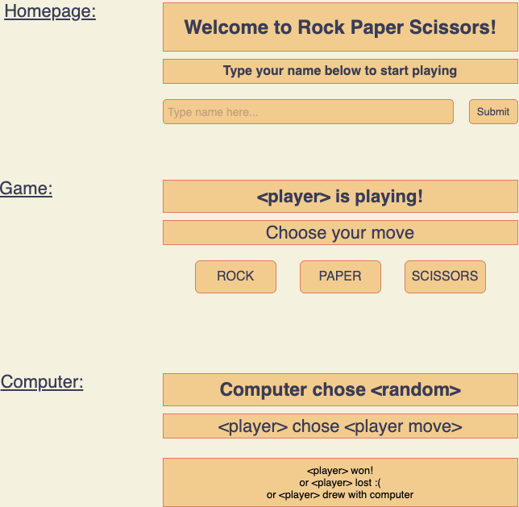

# Rock Paper Scissors Challenge

## Mockup

## Domain Model

| Object | Messages | Properties | Context | Output |
|--------|----------|------------|---------|--------|
| RPS | updateName(name) | name @str | updates player name | string |
| | updateMoves(move) | move @str | updates player move with rock, paper or scissors | string |
| | updateCompMove() | | updates computer move by randomly selecting from rps array | string | 
| | hasLostRock() | | returns win/lose/draw message | string |
| | hasLostPaper() | | returns win/lose/draw message | string |
| | hasLostScissors() | | returns win/lose/draw message | string |